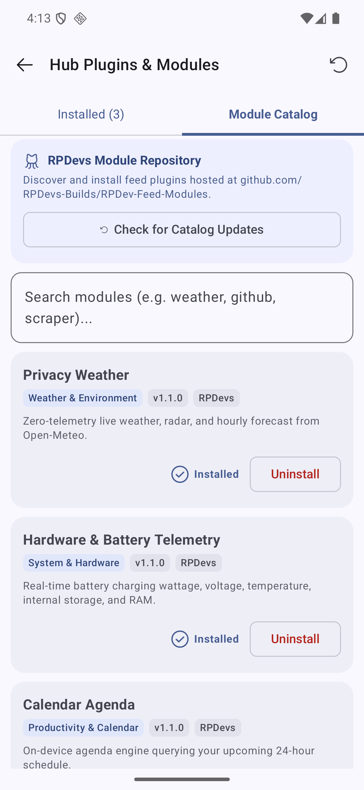

# RPDev Feed Modules & Hub Plugins

  
  
  

Official modular repository and central catalog for custom context modules and plugins designed for **RPDev Feed** and Android launcher feed engines.

---

## 📦 Overview

This repository houses:
1. **Module Catalog (`catalog/modules.json`)**: Master registry queried live by RPDev Feed to discover, install, and update custom context cards.
2. **Android Library Module (`modules/`)**: Kotlin library containing reusable data models (`HubCardData`), contracts (`HubPlugin`), and plugin implementations.
3. **Declarative Custom Modules**: Declarative JSON modules for Home Assistant, Docker telemetry, Uptime Kuma, Gotify, Webpage scrapers, and dynamic REST endpoints.

---

## 🚀 Available Modules in Catalog

| Module | Category | Description |
| :--- | :--- | :--- |
| **Calendar Agenda** | Productivity | 24-hour on-device calendar agenda without external trackers. |
| **GitHub Pulse** | Developer & Code | Live PR review requests, workflow CI results, and notifications. |
| **Webpage Monitor & Keyword Scraper** | Developer & Code | Periodic HTML scraper with MD5 hash diffs and keyword alerts. |
| **Custom REST / JSON Endpoint** | Integrations | Polls arbitrary JSON APIs (Gotify, Home Assistant, Docker). |
| **Home Assistant State Monitor** | Smart Home | Displays entity states, climate sensors, and smart switch toggles. |
| **Docker & Fleet Health** | DevOps & Infra | Server load metrics, container health, and cluster status. |
| **Uptime Kuma Status Monitor** | DevOps & Infra | Latency graphs, heartbeats, and incident notices. |

---

## 📱 In-App Store & Plugin Manager (DevPixel16)

|  |  |
|:---:|:---:|
| **RPDevs Module Repository Catalog** | **Active Plugin Manager &amp; Ordering** |

---

## 🛠️ Contributing a Custom Module

To add your own module to the online store:
1. Fork this repository.
2. Add your module metadata to [`catalog/modules.json`](catalog/modules.json).
3. If providing a declarative manifest or schema, add it under `catalog/manifests/<module_id>.json`.
4. Open a Pull Request. Once merged, it becomes instantly available in the RPDev Feed in-app module marketplace!

---

## 📄 License
GNU General Public License v3.0 (GPL-3.0) - Copyright (c) 2026 RPDevs.
